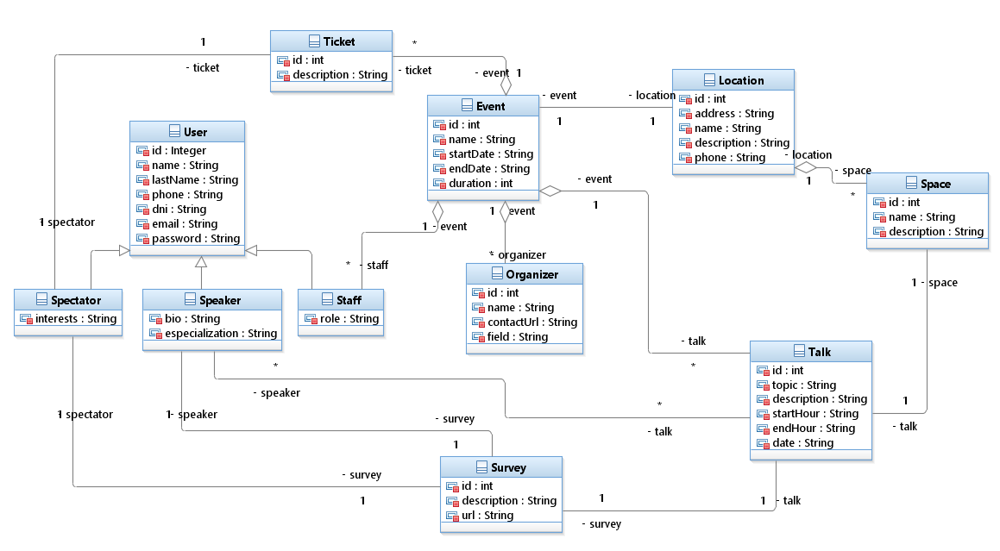

# EvenTour API
[](https://forthebadge.com) [](https://forthebadge.com)

---
To run locally:

- Make sure you have install and run PostgreSQL server
- Create database with the name same as in config file
- Run ```npm install``` or ```yarn install```
- Run ```sequelize db:migrate```
- Run ```nodemon``` or ```npm start```
